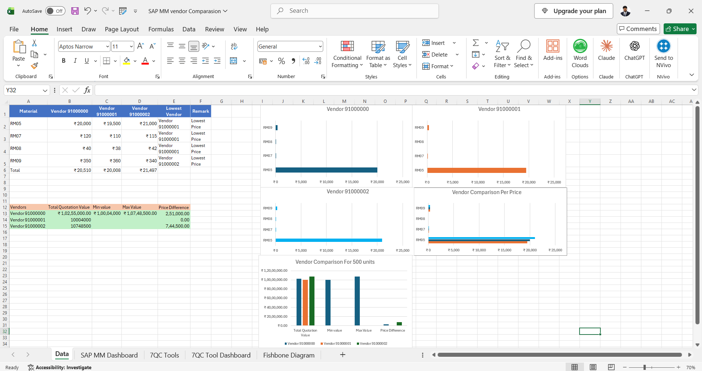
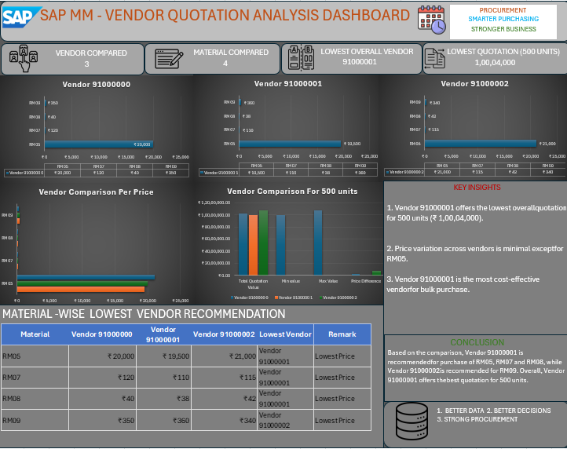
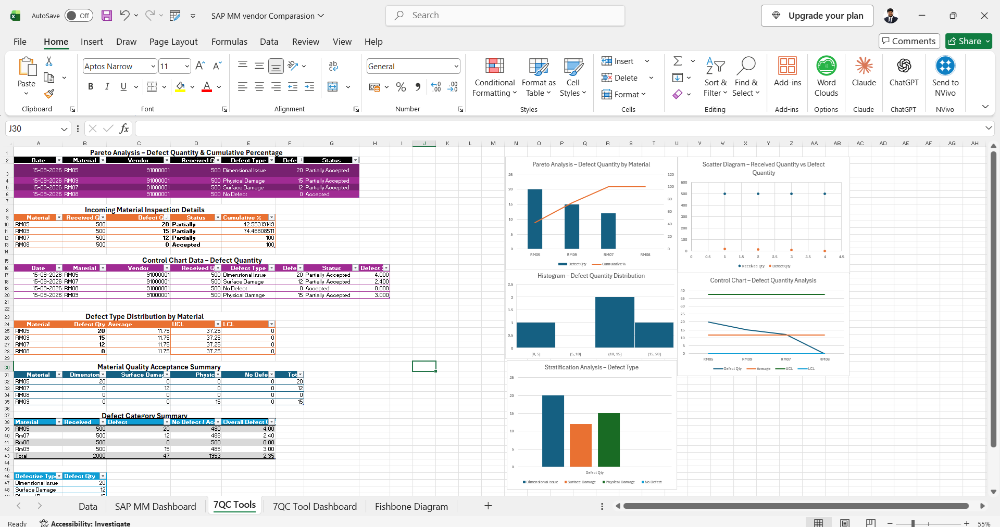
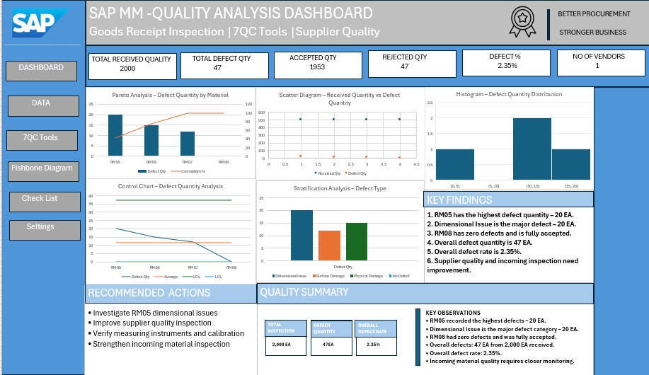

# Excel Analysis – Supplier Quality & Procurement Analysis

This section presents the Excel-based analysis performed for supplier quotation comparison, procurement analysis, material quality analysis, defect analysis, and root cause identification.

[📥 Click to Download XLSX File](./Excel%20Analysis/Excel%20Workbook/SAP_MM_Supplier_Quality_Data_Analysis.xlsx)

---

# 1. Excel Vendor Comparison Analysis

Vendor Comparison Analysis is used to compare the prices quoted by different suppliers for the required materials.

The analysis provides a material-wise comparison of vendor prices along with total quotation values, minimum values, maximum values, and price differences. This helps evaluate supplier quotations in a structured manner and identify the lowest quoted price for each material.



---

# 2. SAP MM Vendor Quotation Analysis Dashboard

This dashboard provides a visual analysis of supplier quotations collected during the SAP MM purchasing process.

It presents vendor-wise quotation values, material-wise prices, quotation differences, and comparative purchasing information. The dashboard helps analyze supplier pricing and supports quotation evaluation.



---

# 3. Excel 7QC Tools Analysis

The 7QC Tools are used to analyze quality-related problems in a structured and visual manner.

In this analysis, Excel is used to perform quality analysis using tools such as Pareto Analysis, Scatter Diagram, Histogram, Control Chart, and Stratification Analysis. These tools help identify defect patterns, major defect areas, variation, and quality trends.



---

# 4. Fishbone Diagram

The Fishbone Diagram, also known as a Cause-and-Effect Diagram, is used to identify possible causes of material quality defects.

The analysis organizes potential causes under major categories such as Measurement, Material, Machine, Environment, Method, and Man. This provides a structured approach for identifying possible root causes of defects found during goods receipt inspection.


---

# 5. SAP MM Quality Analysis Dashboard

This dashboard provides an overall view of supplier and material quality performance based on the analyzed inspection data.

It presents key quality indicators such as total received quantity, total defect quantity, accepted quantity, rejected quantity, defect percentage, and other quality-related observations. The dashboard brings together the results of the quality analysis into a summarized visual format.




---

# 📊 Excel Analysis Flow

```text
Vendor Comparison Analysis
        ↓
Vendor Quotation Analysis Dashboard
        ↓
7QC Tools Analysis
        ↓
Fishbone Root Cause Analysis
        ↓
Quality Analysis Dashboard
