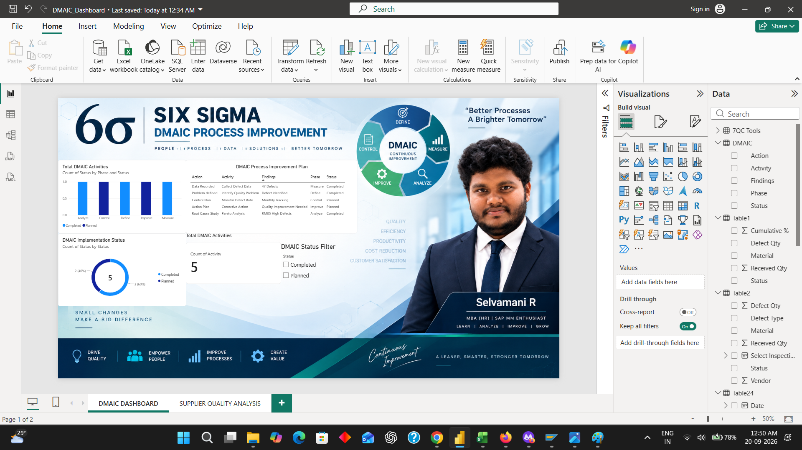
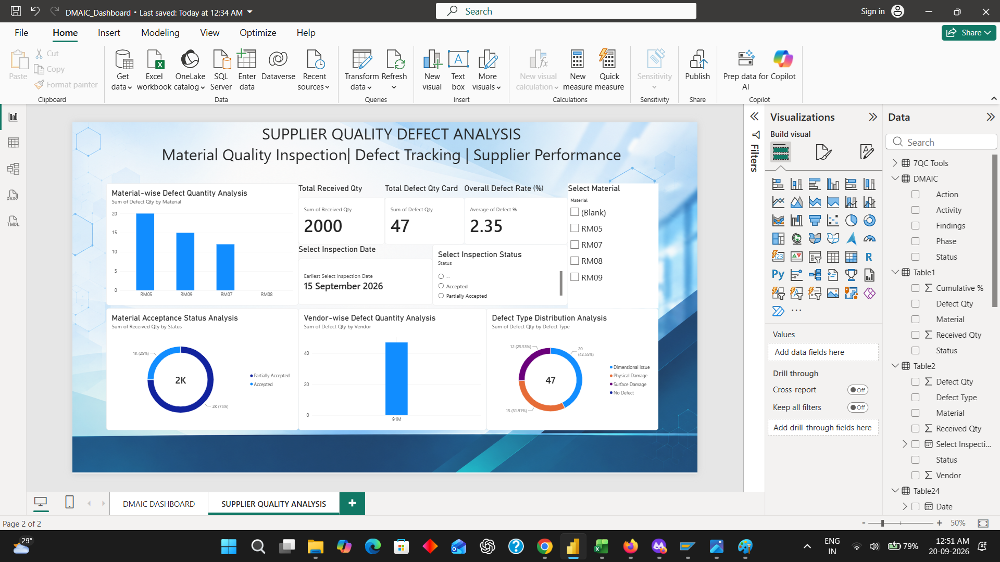

# Power BI – Supplier Quality & DMAIC Analysis

This section presents the Power BI dashboards developed to visualize procurement, quality, defect, and supplier-related analysis.

The dashboards convert the analyzed data into interactive visuals and key performance indicators to support quality monitoring and supplier performance analysis.

[📥 Click to Download PBIX File](./PowerBI%20Dashboard/SAP_MM_Supplier_Quality_Dashboard.pbix)

---

# 1. DMAIC Process Improvement Dashboard

The DMAIC Process Improvement Dashboard provides a structured view of the **Define, Measure, Analyze, Improve, and Control** stages of the Six Sigma improvement approach.

The dashboard summarizes DMAIC activities, implementation status, findings, and improvement actions. It provides a high-level view of the progress of the quality improvement process.



---

# 2. Supplier Quality Defect Analysis Dashboard

The Supplier Quality Defect Analysis Dashboard focuses on material quality inspection and supplier-related defect analysis.

It presents key indicators such as total received quantity, total defect quantity, overall defect rate, material-wise defect quantity, vendor-wise defect quantity, defect type distribution, and material acceptance status.



---

# 📊 Power BI Analysis Flow

```text
SAP MM Procurement Data
        ↓
Quality & Defect Data
        ↓
Data Preparation
        ↓
Power BI Data Model
        ↓
Interactive Visualizations
        ↓
DMAIC Dashboard
        ↓
Supplier Quality Dashboard
        ↓
Quality & Supplier Insights
