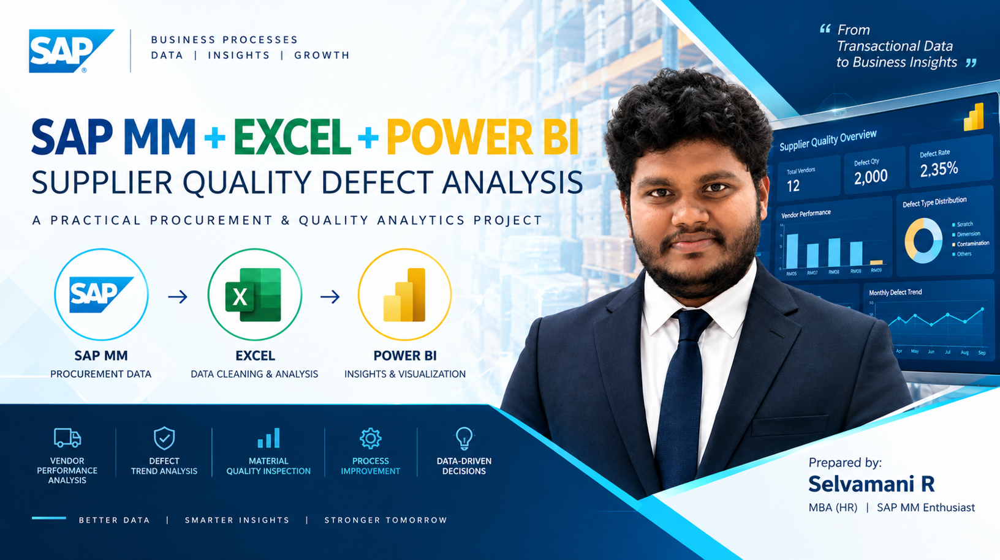

# SAP MM Supplier Quality Analysis

<p align="center">
  
</p>

---

## 📌 Project Overview

This project demonstrates an end-to-end **SAP MM Procurement and Supplier Quality Analysis** workflow using SAP MM, Microsoft Excel, Power BI, 7QC Tools, and Six Sigma DMAIC.

The project connects procurement transactions with material quality inspection, supplier quotation comparison, defect analysis, root cause identification, and dashboard-based insights.

---

## 📂 Project Navigation

| Module | Description |
|--------|-------------|
| 📦 [SAP MM](./SAP%20MM/Readme.md) | SAP MM procurement process, transactions and practical screenshots |
| 📊 [Excel Analysis](./Excel%20Analysis/Readme.md) | Vendor comparison, quotation analysis, 7QC Tools and Fishbone Analysis |
| 📈 [Power BI](./PowerBI/Readme.md) | DMAIC and Supplier Quality interactive dashboards |

---

## 🎯 Project Objectives

- Demonstrate practical SAP MM procurement activities
- Analyze supplier quotations and vendor pricing
- Track material quality and defect information
- Apply 7QC Tools for quality analysis
- Identify possible root causes using Fishbone Analysis
- Develop Power BI dashboards for supplier and quality analysis
- Present procurement and quality insights in a structured format

---

## 🔄 End-to-End Project Flow

```text
Material Creation
        ↓
Request for Quotation
        ↓
Vendor Quotation
        ↓
Vendor Comparison
        ↓
Purchase Requisition
        ↓
Purchase Order
        ↓
Goods Receipt
        ↓
Material Document
        ↓
Excel Analysis
        ↓
7QC Tools
        ↓
Fishbone Analysis
        ↓
Power BI Dashboards
        ↓
Supplier Quality Insights
        ↓
Procurement & Quality Improvement
        ↓
Cancellation of Material Document
        ↓
Return Delivery to Vendor
        ↓
Invoice Verification (MIRO)
